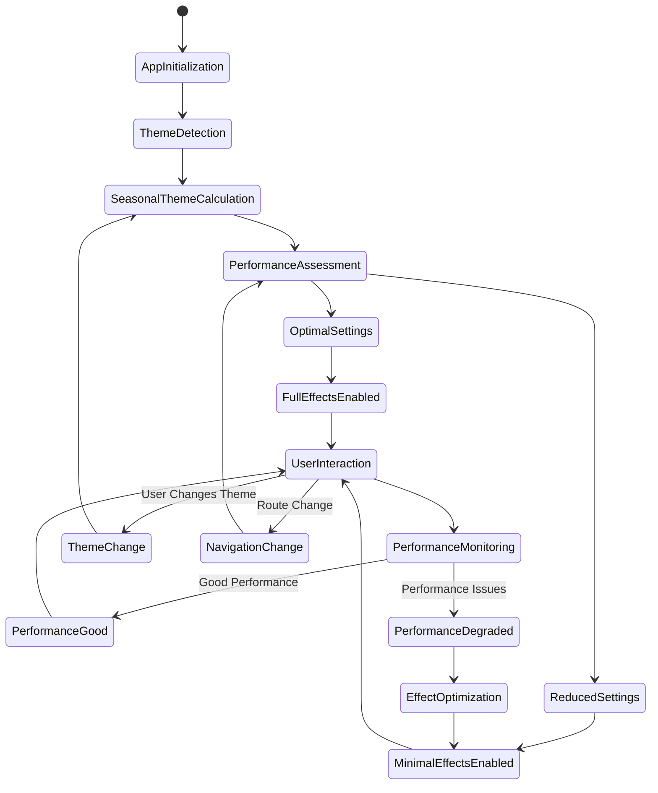

# Architecture Diagrams - Liquid Glass Tech Blog

## System Architecture Overview

```mermaid
graph TB
    subgraph "Client Layer"
        A[Browser] --> B[Next.js App Router]
        B --> C[React Components]
        C --> D[Liquid Glass Effects]
    end
    
    subgraph "UI Component Libraries"
        E[@developer-hub/liquid-glass]
        F[shadcn/ui Components]
        G[glasscn-ui Themes]
    end
    
    subgraph "Business Logic"
        H[MDX Content Processing]
        I[AI Image Generation]
        J[Effect Management]
        K[Performance Monitoring]
    end
    
    subgraph "External Services"
        L[OpenAI DALL-E 3]
        M[Cloudinary CDN]
        N[Weather API]
    end
    
    subgraph "Data Layer"
        O[Static MDX Files]
        P[Generated Images]
        Q[Effect Library]
    end
    
    C --> E
    C --> F
    C --> G
    
    D --> H
    D --> I
    D --> J
    D --> K
    
    I --> L
    J --> M
    K --> N
    
    H --> O
    I --> P
    J --> Q
    
    classDef clientLayer fill:#e1f5fe
    classDef uiLibs fill:#f3e5f5
    classDef businessLogic fill:#e8f5e8
    classDef external fill:#fff3e0
    classDef data fill:#fce4ec
    
    class A,B,C,D clientLayer
    class E,F,G uiLibs
    class H,I,J,K businessLogic
    class L,M,N external
    class O,P,Q data
```

## Component Architecture


## Data Flow Architecture


## MDX Content Processing Flow


## AI Image Generation Workflow


## Effect Editor Architecture


## Performance Monitoring System


## Security Architecture


## Deployment Architecture


## Mobile-First Responsive Design


## State Management Flow



This architecture documentation provides comprehensive visual representations of the system design, showing how all components interact and flow together to create the Liquid Glass Tech Blog platform. Each diagram illustrates different aspects of the system from high-level architecture down to specific implementation details.