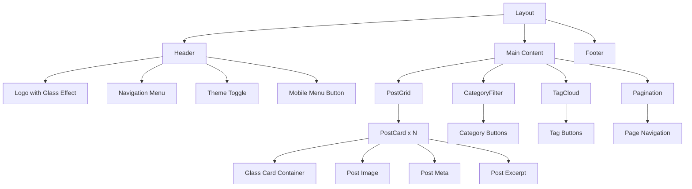
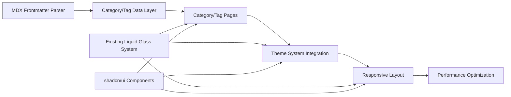

# Phase 6 Architecture: Blog CMS & Frontend Implementation

## Executive Summary

Phase 6 focuses on implementing the core blog functionality with category/tag navigation, theme switching, and responsive design using Next.js 15 App Router with liquid glass visual effects. This phase completes 34 remaining tasks across 8 sub-phases with a comprehensive architecture leveraging research-validated technologies.

## 1. Phase 6 Architecture Design

### 1.1 File Structure for Category/Tag Dynamic Routing

```
app/
├── page.tsx                     # Homepage with liquid glass card grid
├── posts/
│   └── [slug]/
│       ├── page.tsx            # Individual post with liquid glass effects
│       └── loading.tsx         # Skeleton with glass shimmer
├── categories/
│   ├── page.tsx               # All categories overview
│   └── [category]/
│       ├── page.tsx           # Category-filtered posts
│       └── loading.tsx        # Category loading state
├── tags/
│   ├── page.tsx               # All tags overview  
│   └── [tag]/
│       ├── page.tsx           # Tag-filtered posts
│       └── loading.tsx        # Tag loading state
└── globals.css                # Tailwind + liquid glass variables

components/
├── layout/
│   ├── Layout.tsx             # Main responsive layout
│   ├── Header.tsx             # Navigation with glass nav
│   ├── Footer.tsx             # Footer with glass effects
│   └── MobileNav.tsx          # Hamburger menu with animations
├── blog/
│   ├── PostCard.tsx           # shadcn/ui Card + liquid glass
│   ├── PostGrid.tsx           # Responsive grid layout
│   ├── CategoryFilter.tsx     # Filter UI with glass buttons
│   ├── TagCloud.tsx           # Interactive tag cloud
│   └── Pagination.tsx         # Paginated navigation
├── ui/                        # shadcn/ui components
└── liquid-glass/              # @developer-hub/liquid-glass integrations

lib/
├── blog/
│   ├── posts.ts               # Post data fetching
│   ├── categories.ts          # Category management
│   └── tags.ts                # Tag management
├── mdx/
│   └── frontmatter.ts         # MDX frontmatter parsing
└── utils/
    ├── generateStaticParams.ts # Static param generation
    └── seo.ts                 # SEO metadata generation
```

### 1.2 Component Hierarchy for Blog Navigation



### 1.3 Data Flow for Category/Tag Filtering

```typescript
// Data Flow Architecture
interface BlogDataFlow {
  // 1. Static Generation at Build Time
  generateStaticParams: () => Promise<StaticParams[]>
  
  // 2. Post Data Fetching
  getAllPosts: () => Promise<BlogPost[]>
  getPostsByCategory: (category: string) => Promise<BlogPost[]>
  getPostsByTag: (tag: string) => Promise<BlogPost[]>
  
  // 3. Frontmatter Processing
  parseFrontmatter: (content: string) => PostMetadata
  
  // 4. Client-Side Filtering
  filterPosts: (posts: BlogPost[], filters: FilterCriteria) => BlogPost[]
  
  // 5. SEO Generation
  generateSEO: (posts: BlogPost[], filter: string) => SEOMetadata
}

// Category/Tag Data Structure
interface PostMetadata {
  title: string
  description: string
  categories: string[]
  tags: string[]
  date: string
  eyecatch?: string
  author?: string
  readingTime?: number
}

interface FilterCriteria {
  category?: string
  tag?: string
  sortBy?: 'date' | 'title' | 'readingTime'
  sortOrder?: 'asc' | 'desc'
}
```

### 1.4 State Management for Theme Toggle

```typescript
// Theme State Architecture using Zustand + next-themes
interface ThemeState {
  // Theme Management
  theme: 'light' | 'dark' | 'system'
  systemTheme: 'light' | 'dark'
  resolvedTheme: 'light' | 'dark'
  
  // Seasonal Theme Integration
  seasonalTheme: SeasonalTheme
  enableSeasonalEffects: boolean
  
  // Liquid Glass Settings
  glassIntensity: 'subtle' | 'medium' | 'intense'
  enableParticles: boolean
  enableMotion: boolean
  
  // Accessibility
  prefersReducedMotion: boolean
  highContrast: boolean
  
  // Actions
  setTheme: (theme: Theme) => void
  toggleSeasonalEffects: () => void
  setGlassIntensity: (intensity: GlassIntensity) => void
  updateAccessibilitySettings: () => void
}

// Integration with existing liquid glass effects
interface SeasonalTheme {
  season: 'spring' | 'summer' | 'autumn' | 'winter'
  colors: {
    primary: string
    secondary: string
    accent: string
  }
  particles: ParticleConfig
  glassEffect: GlassEffectConfig
}
```

### 1.5 Integration Points with Existing Liquid Glass Effects

```typescript
// Integration Architecture
interface LiquidGlassIntegration {
  // Existing Components (Phases 2-3)
  LiquidGlassCard: ComponentType<LiquidGlassCardProps>
  ParticleSystem: ComponentType<ParticleSystemProps>
  SeasonalTheme: ComponentType<SeasonalThemeProps>
  
  // New Phase 6 Integrations
  BlogPostCard: ComponentType<BlogPostCardProps>
  CategoryButton: ComponentType<CategoryButtonProps>
  TagButton: ComponentType<TagButtonProps>
  NavigationMenu: ComponentType<NavigationMenuProps>
  ThemeToggle: ComponentType<ThemeToggleProps>
  
  // Unified Glass Effect System
  glassEffectRegistry: Map<string, GlassEffectConfig>
  applyGlassEffect: (component: string, intensity: GlassIntensity) => CSSProperties
  
  // Performance Integration
  glassOptimization: {
    enableGPUAcceleration: boolean
    adaptToDeviceCapability: boolean
    fallbackToStaticStyles: boolean
  }
}
```

## 2. Implementation Strategy

### 2.1 Development Sequence for 34 Remaining Tasks

#### **Priority 1: Core Navigation (Tasks 6.3-6.4)**
1. **6.3 Category/Tag Pages Test Implementation** (2 days)
   - Create test suites for dynamic routing
   - Implement MDX frontmatter parsing tests
   - Test category/tag filtering logic

2. **6.4 Category/Tag Pages Implementation** (3 days)
   - Implement `app/categories/[category]/page.tsx`
   - Implement `app/tags/[tag]/page.tsx`
   - Create `generateStaticParams` functions
   - Integrate with existing liquid glass card system

#### **Priority 2: Theme System (Tasks 6.5-6.6)**
3. **6.5 Theme Toggle Test Implementation** (2 days)
   - Test next-themes integration
   - Test liquid glass theme persistence
   - Test accessibility compliance

4. **6.6 Theme Toggle Implementation** (3 days)
   - Implement ThemeToggle component with shadcn/ui
   - Integrate with existing seasonal theme system
   - Add liquid glass toggle animations

#### **Priority 3: Responsive Layout (Tasks 6.7-6.8)**
5. **6.7 Responsive Layout Test Implementation** (2 days)
   - Test mobile-first design approach
   - Test touch interactions with liquid glass
   - Test performance across devices

6. **6.8 Responsive Layout Implementation** (4 days)
   - Implement mobile-first responsive layout
   - Optimize liquid glass effects for mobile
   - Implement touch-optimized navigation

### 2.2 Component Dependencies and Build Order



### 2.3 Testing Strategy with Playwright MCP

#### **Automated Testing Approach**
```typescript
// E2E Testing Strategy
interface PlaywrightTestSuite {
  // Category/Tag Navigation Tests
  categoryNavigation: {
    testCategoryFiltering: () => Promise<void>
    testTagFiltering: () => Promise<void>
    testCombinedFilters: () => Promise<void>
    testPagination: () => Promise<void>
  }
  
  // Theme System Tests
  themeToggle: {
    testLightDarkToggle: () => Promise<void>
    testSeasonalThemeIntegration: () => Promise<void>
    testLiquidGlassThemeSync: () => Promise<void>
    testAccessibilityCompliance: () => Promise<void>
  }
  
  // Responsive Design Tests
  responsiveDesign: {
    testMobileNavigation: () => Promise<void>
    testTabletLayout: () => Promise<void>
    testDesktopLayout: () => Promise<void>
    testTouchInteractions: () => Promise<void>
  }
  
  // Performance Tests
  performanceValidation: {
    testCoreWebVitals: () => Promise<WebVitalsReport>
    testLiquidGlassPerformance: () => Promise<PerformanceReport>
    testImageOptimization: () => Promise<ImageOptimizationReport>
  }
}
```

### 2.4 Performance Optimization Approach

#### **Core Web Vitals Targets**
- **LCP (Largest Contentful Paint)**: < 2.5s
- **INP (Interaction to Next Paint)**: < 200ms  
- **CLS (Cumulative Layout Shift)**: < 0.1

#### **Optimization Strategy**
```typescript
interface PerformanceOptimization {
  // Image Optimization
  imageStrategy: {
    format: 'WebP' | 'AVIF'
    sizes: number[]
    lazyLoading: boolean
    placeholder: 'blur' | 'empty'
  }
  
  // Code Splitting
  codeSplietting: {
    dynamicImports: string[]
    bundleAnalysis: BundleReport
    treeshaking: OptimizationConfig
  }
  
  // Liquid Glass Optimization
  glassOptimization: {
    gpuAcceleration: boolean
    compositeLayers: string[]
    performanceAdaptation: DeviceCapabilityMap
  }
  
  // Caching Strategy
  cachingStrategy: {
    staticAssets: CacheConfig
    apiResponses: CacheConfig
    imageAssets: CacheConfig
  }
}
```

### 2.5 Error Handling and Edge Cases

#### **Error Scenarios**
1. **Category/Tag Not Found**
   - Redirect to 404 with liquid glass effect
   - Suggest similar categories/tags
   - Graceful fallback to homepage

2. **MDX Parsing Errors**
   - Display error boundary with glass styling
   - Log error details for debugging
   - Show fallback content

3. **Theme Loading Failures**
   - Fallback to system theme
   - Retry mechanism with exponential backoff
   - User notification with recovery options

4. **Performance Degradation**
   - Automatic liquid glass effect reduction
   - Progressive enhancement fallbacks
   - Performance monitoring alerts

## 3. Technology Integration Plan

### 3.1 Next.js 15 App Router Implementation Details

#### **Dynamic Routes Configuration**
```typescript
// app/categories/[category]/page.tsx
export async function generateStaticParams() {
  const categories = await getAllCategories()
  return categories.map((category) => ({
    category: category.slug,
  }))
}

export async function generateMetadata({ params }: { params: { category: string } }) {
  const category = await getCategoryData(params.category)
  return {
    title: `${category.name} - Liquid Glass Tech Blog`,
    description: `Explore ${category.name} articles with interactive liquid glass effects`,
    openGraph: {
      title: `${category.name} Articles`,
      description: category.description,
      images: [category.ogImage],
    },
  }
}

// Async params pattern for Next.js 15
export default async function CategoryPage({ 
  params 
}: { 
  params: Promise<{ category: string }> 
}) {
  const { category } = await params
  const posts = await getPostsByCategory(category)
  const categoryData = await getCategoryData(category)
  
  return (
    <CategoryPageContent posts={posts} category={categoryData} />
  )
}
```

#### **Streaming and Suspense Integration**
```typescript
// Streaming architecture for better performance
export default function CategoryPage({ params }: CategoryPageProps) {
  return (
    <Suspense fallback={<CategoryPageSkeleton />}>
      <CategoryContent params={params} />
    </Suspense>
  )
}

function CategoryPageSkeleton() {
  return (
    <div className="space-y-6">
      <LiquidGlassCard variant="subtle" className="h-48">
        <div className="animate-pulse bg-gradient-to-r from-glass-200 to-glass-300 h-full rounded-lg" />
      </LiquidGlassCard>
      {/* More skeleton components with glass effects */}
    </div>
  )
}
```

### 3.2 MDX Frontmatter Integration

#### **Frontmatter Schema**
```typescript
interface BlogPostFrontmatter {
  // Basic Metadata
  title: string
  description: string
  date: string
  author?: string
  
  // Categorization
  categories: string[]
  tags: string[]
  
  // Visual
  eyecatch?: string
  eyecatchAlt?: string
  
  // Liquid Glass Configuration
  glassEffect?: {
    intensity: 'subtle' | 'medium' | 'intense'
    variant: string
    particles?: boolean
  }
  
  // SEO
  slug?: string
  canonicalUrl?: string
  noindex?: boolean
  
  // Reading Experience
  readingTime?: number
  tableOfContents?: boolean
  
  // Social
  socialImage?: string
  twitterCard?: 'summary' | 'summary_large_image'
}
```

#### **MDX Processing Pipeline**
```typescript
// lib/mdx/processor.ts
export class MDXProcessor {
  private readonly remarkPlugins = [
    remarkFrontmatter,
    remarkParseFrontmatter,
    remarkGfm,
    remarkMath,
  ]
  
  private readonly rehypePlugins = [
    rehypeSlug,
    rehypeAutolinkHeadings,
    rehypeHighlight,
    rehypeLiquidGlass, // Custom plugin for liquid glass integration
  ]
  
  async processPost(filePath: string): Promise<ProcessedPost> {
    const source = await fs.readFile(filePath, 'utf-8')
    const { data: frontmatter, content } = matter(source)
    
    const mdxSource = await serialize(content, {
      mdxOptions: {
        remarkPlugins: this.remarkPlugins,
        rehypePlugins: this.rehypePlugins,
      },
      parseFrontmatter: true,
    })
    
    return {
      frontmatter: this.validateFrontmatter(frontmatter),
      mdxSource,
      readingTime: this.calculateReadingTime(content),
      tableOfContents: this.generateTOC(content),
    }
  }
}
```

### 3.3 next-themes Integration with Existing Layout

#### **Theme Provider Configuration**
```typescript
// app/providers.tsx
'use client'

import { ThemeProvider } from 'next-themes'
import { SeasonalThemeProvider } from '@/lib/theme/seasonalTheme'
import { LiquidGlassProvider } from '@developer-hub/liquid-glass'

export function Providers({ children }: { children: React.ReactNode }) {
  return (
    <ThemeProvider
      attribute="class"
      defaultTheme="system"
      enableSystem
      disableTransitionOnChange={false}
      storageKey="liquid-glass-theme"
      themes={['light', 'dark', 'spring', 'summer', 'autumn', 'winter']}
    >
      <SeasonalThemeProvider>
        <LiquidGlassProvider 
          config={{
            gpuAcceleration: true,
            adaptToPerformance: true,
            respectMotionPreferences: true,
          }}
        >
          {children}
        </LiquidGlassProvider>
      </SeasonalThemeProvider>
    </ThemeProvider>
  )
}
```

#### **Theme Toggle Component Integration**
```typescript
// components/ui/ThemeToggle.tsx
'use client'

import { useTheme } from 'next-themes'
import { useSeasonalTheme } from '@/lib/theme/seasonalTheme'
import { useLiquidGlass } from '@developer-hub/liquid-glass'
import { Button } from '@/components/ui/button'
import { Moon, Sun, Sparkles } from 'lucide-react'

export function ThemeToggle() {
  const { theme, setTheme, systemTheme, resolvedTheme } = useTheme()
  const { currentSeason, toggleSeasonalEffects, enableSeasonalEffects } = useSeasonalTheme()
  const { applyGlassEffect, glassIntensity, setGlassIntensity } = useLiquidGlass()
  
  const toggleTheme = () => {
    if (resolvedTheme === 'dark') {
      setTheme('light')
    } else {
      setTheme('dark')
    }
  }
  
  return (
    <div className="flex items-center space-x-2">
      <Button
        variant="ghost"
        size="icon"
        onClick={toggleTheme}
        className={applyGlassEffect('theme-toggle', glassIntensity)}
        aria-label="Toggle theme"
      >
        {resolvedTheme === 'dark' ? (
          <Sun className="h-4 w-4" />
        ) : (
          <Moon className="h-4 w-4" />
        )}
      </Button>
      
      <Button
        variant="ghost"
        size="icon"
        onClick={toggleSeasonalEffects}
        className={applyGlassEffect('seasonal-toggle', glassIntensity)}
        aria-label="Toggle seasonal effects"
        data-seasonal={enableSeasonalEffects}
      >
        <Sparkles className="h-4 w-4" />
      </Button>
    </div>
  )
}
```

### 3.4 Responsive Design System Enhancement

#### **Tailwind CSS Configuration**
```javascript
// tailwind.config.js
module.exports = {
  content: ['./app/**/*.{js,ts,jsx,tsx}', './components/**/*.{js,ts,jsx,tsx}'],
  darkMode: 'class',
  theme: {
    extend: {
      screens: {
        'xs': '475px',
        'sm': '640px',
        'md': '768px',
        'lg': '1024px',
        'xl': '1280px',
        '2xl': '1536px',
        '3xl': '1920px',
      },
      spacing: {
        'glass-sm': '0.5rem',
        'glass-md': '1rem',
        'glass-lg': '1.5rem',
        'glass-xl': '2rem',
      },
      backdropBlur: {
        'glass-sm': '4px',
        'glass-md': '8px',
        'glass-lg': '16px',
        'glass-xl': '24px',
      },
      colors: {
        glass: {
          50: 'rgba(255, 255, 255, 0.05)',
          100: 'rgba(255, 255, 255, 0.10)',
          200: 'rgba(255, 255, 255, 0.15)',
          300: 'rgba(255, 255, 255, 0.20)',
          400: 'rgba(255, 255, 255, 0.25)',
          500: 'rgba(255, 255, 255, 0.30)',
        },
      },
      animation: {
        'glass-shimmer': 'glass-shimmer 2s linear infinite',
        'glass-pulse': 'glass-pulse 2s cubic-bezier(0.4, 0, 0.6, 1) infinite',
      },
      keyframes: {
        'glass-shimmer': {
          '0%': { backgroundPosition: '-200% 0' },
          '100%': { backgroundPosition: '200% 0' },
        },
        'glass-pulse': {
          '0%, 100%': { opacity: '1' },
          '50%': { opacity: '.5' },
        },
      },
    },
  },
  plugins: [
    require('@tailwindcss/typography'),
    require('tailwindcss-animate'),
    require('./lib/tailwind/liquid-glass-plugin'),
  ],
}
```

#### **Mobile-First Component Design**
```typescript
// components/blog/PostGrid.tsx
'use client'

import { useMemo } from 'react'
import { useDeviceType } from '@/hooks/useDeviceType'
import { PostCard } from './PostCard'
import { LiquidGlassCard } from '@/components/liquid-glass/LiquidGlassCard'

interface PostGridProps {
  posts: BlogPost[]
  category?: string
  tag?: string
}

export function PostGrid({ posts, category, tag }: PostGridProps) {
  const { isMobile, isTablet, isDesktop } = useDeviceType()
  
  const gridConfig = useMemo(() => {
    if (isMobile) return {
      columns: 1,
      gap: 'gap-4',
      glassIntensity: 'subtle' as const,
      enableParticles: false,
    }
    if (isTablet) return {
      columns: 2,
      gap: 'gap-6',
      glassIntensity: 'medium' as const,
      enableParticles: true,
    }
    return {
      columns: 3,
      gap: 'gap-8',
      glassIntensity: 'intense' as const,
      enableParticles: true,
    }
  }, [isMobile, isTablet, isDesktop])
  
  return (
    <div className={`
      grid 
      ${gridConfig.columns === 1 ? 'grid-cols-1' : 
        gridConfig.columns === 2 ? 'grid-cols-1 md:grid-cols-2' : 
        'grid-cols-1 md:grid-cols-2 lg:grid-cols-3'}
      ${gridConfig.gap}
      auto-rows-fr
    `}>
      {posts.map((post) => (
        <PostCard
          key={post.slug}
          post={post}
          glassIntensity={gridConfig.glassIntensity}
          enableParticles={gridConfig.enableParticles}
        />
      ))}
    </div>
  )
}
```

### 3.5 SEO Optimization for Category/Tag Pages

#### **Dynamic Metadata Generation**
```typescript
// lib/seo/metadata.ts
export async function generateCategoryMetadata(category: string): Promise<Metadata> {
  const categoryData = await getCategoryData(category)
  const posts = await getPostsByCategory(category)
  
  return {
    title: `${categoryData.name} Articles - Liquid Glass Tech Blog`,
    description: `Explore ${posts.length} articles about ${categoryData.name} with interactive liquid glass effects and cutting-edge web technologies.`,
    keywords: [categoryData.name, ...categoryData.tags, 'liquid glass', 'web development'],
    openGraph: {
      title: `${categoryData.name} - Interactive Tech Articles`,
      description: categoryData.description,
      images: [
        {
          url: categoryData.ogImage || `/api/og/category/${category}`,
          width: 1200,
          height: 630,
          alt: `${categoryData.name} category`,
        },
      ],
      type: 'website',
      siteName: 'Liquid Glass Tech Blog',
    },
    twitter: {
      card: 'summary_large_image',
      title: `${categoryData.name} Articles`,
      description: categoryData.description,
      images: [categoryData.twitterImage || categoryData.ogImage],
    },
    alternates: {
      canonical: `/categories/${category}`,
    },
    other: {
      'article:section': categoryData.name,
      'article:tag': categoryData.tags.join(', '),
    },
  }
}

// Structured Data Generation
export function generateCategoryStructuredData(category: CategoryData, posts: BlogPost[]): JsonLd {
  return {
    '@context': 'https://schema.org',
    '@type': 'CollectionPage',
    name: `${category.name} Articles`,
    description: category.description,
    url: `https://liquid-glass-blog.com/categories/${category.slug}`,
    mainEntity: {
      '@type': 'ItemList',
      numberOfItems: posts.length,
      itemListElement: posts.map((post, index) => ({
        '@type': 'ListItem',
        position: index + 1,
        item: {
          '@type': 'BlogPosting',
          headline: post.title,
          description: post.description,
          url: `https://liquid-glass-blog.com/posts/${post.slug}`,
          datePublished: post.date,
          author: {
            '@type': 'Person',
            name: post.author,
          },
        },
      })),
    },
    breadcrumb: {
      '@type': 'BreadcrumbList',
      itemListElement: [
        {
          '@type': 'ListItem',
          position: 1,
          name: 'Home',
          item: 'https://liquid-glass-blog.com',
        },
        {
          '@type': 'ListItem',
          position: 2,
          name: 'Categories',
          item: 'https://liquid-glass-blog.com/categories',
        },
        {
          '@type': 'ListItem',
          position: 3,
          name: category.name,
          item: `https://liquid-glass-blog.com/categories/${category.slug}`,
        },
      ],
    },
  }
}
```

## 4. Quality Assurance Strategy

### 4.1 TDD Approach for New Components

#### **Testing Pyramid for Phase 6**
```typescript
// 1. Unit Tests (70%)
describe('CategoryFilter Component', () => {
  it('should render all categories with liquid glass effects', () => {
    const categories = mockCategories
    render(<CategoryFilter categories={categories} />)
    
    categories.forEach(category => {
      const button = screen.getByRole('button', { name: category.name })
      expect(button).toBeInTheDocument()
      expect(button).toHaveClass('glass-effect')
    })
  })
  
  it('should apply correct glass intensity based on props', () => {
    render(<CategoryFilter categories={mockCategories} glassIntensity="intense" />)
    
    const buttons = screen.getAllByRole('button')
    buttons.forEach(button => {
      expect(button).toHaveClass('glass-intense')
    })
  })
})

// 2. Integration Tests (20%)
describe('Category Page Integration', () => {
  it('should navigate between categories with proper state management', async () => {
    render(<CategoryPage category="frontend" />)
    
    // Test category loading
    expect(screen.getByText('Frontend Articles')).toBeInTheDocument()
    
    // Test tag filtering within category
    const tagButton = screen.getByRole('button', { name: 'React' })
    await userEvent.click(tagButton)
    
    // Verify filtered results
    const posts = screen.getAllByTestId('post-card')
    posts.forEach(post => {
      expect(post).toHaveAttribute('data-tags', expect.stringContaining('React'))
    })
  })
})

// 3. E2E Tests (10%)
describe('Blog Navigation E2E', () => {
  it('should provide seamless navigation experience with liquid glass effects', async () => {
    await page.goto('/categories/frontend')
    
    // Test category page loading with glass effects
    await expect(page.locator('.glass-effect')).toBeVisible()
    
    // Test post card interactions
    await page.hover('.post-card')
    await expect(page.locator('.glass-hover-effect')).toBeVisible()
    
    // Test theme toggle functionality
    await page.click('[aria-label="Toggle theme"]')
    await expect(page.locator('html')).toHaveClass('dark')
    
    // Test mobile navigation
    await page.setViewportSize({ width: 375, height: 667 })
    await page.click('[aria-label="Open menu"]')
    await expect(page.locator('.mobile-nav')).toBeVisible()
  })
})
```

### 4.2 Accessibility Testing Requirements

#### **WCAG 2.1 AA Compliance Checklist**
```typescript
// Accessibility Testing Suite
interface AccessibilityRequirements {
  // Keyboard Navigation
  keyboardNavigation: {
    tabOrder: 'logical and predictable',
    focusVisible: 'clear focus indicators on all interactive elements',
    skipLinks: 'skip to main content functionality',
    trapFocus: 'modal and dropdown focus management',
  }
  
  // Screen Reader Compatibility
  screenReader: {
    semanticHTML: 'proper heading hierarchy (h1-h6)',
    ariaLabels: 'descriptive labels for all interactive elements',
    landmarks: 'nav, main, aside, footer regions',
    liveRegions: 'dynamic content announcements',
  }
  
  // Visual Accessibility
  visual: {
    colorContrast: 'minimum 4.5:1 for normal text, 3:1 for large text',
    colorBlindness: 'information not conveyed by color alone',
    textScaling: 'readable at 200% zoom',
    reducedMotion: 'respects prefers-reduced-motion',
  }
  
  // Interactive Elements
  interactive: {
    touchTargets: 'minimum 44x44px touch targets',
    formLabels: 'explicit labels for all form controls',
    errorHandling: 'clear error messages and recovery',
    timeout: 'no automatic timeouts or warning provided',
  }
}

// Automated Accessibility Testing
export class AccessibilityTester {
  async testComponent(component: string): Promise<AccessibilityReport> {
    const { render } = await import('@testing-library/react')
    const { axe, toHaveNoViolations } = await import('jest-axe')
    
    expect.extend(toHaveNoViolations)
    
    const { container } = render(<Component />)
    const results = await axe(container)
    
    expect(results).toHaveNoViolations()
    
    return {
      component,
      violations: results.violations,
      passes: results.passes,
      incomplete: results.incomplete,
    }
  }
}
```

### 4.3 Performance Benchmarking Targets

#### **Core Web Vitals Monitoring**
```typescript
interface PerformanceTargets {
  coreWebVitals: {
    LCP: {
      target: '< 2.5s',
      measurement: 'largest contentful paint',
      optimization: ['image optimization', 'critical CSS', 'resource hints'],
    }
    INP: {
      target: '< 200ms',
      measurement: 'interaction to next paint',
      optimization: ['code splitting', 'main thread optimization', 'event handler optimization'],
    }
    CLS: {
      target: '< 0.1',
      measurement: 'cumulative layout shift',
      optimization: ['size attributes on images', 'reserved space for ads', 'font loading optimization'],
    }
  }
  
  liquidGlassPerformance: {
    frameRate: {
      target: '60 FPS',
      measurement: 'consistent animation performance',
      optimization: ['GPU acceleration', 'composite layers', 'reduced motion fallbacks'],
    }
    memoryUsage: {
      target: '< 50MB heap growth',
      measurement: 'memory leak prevention',
      optimization: ['cleanup on unmount', 'efficient effect management', 'garbage collection'],
    }
    bundleSize: {
      target: '< 85KB first load JS',
      measurement: 'initial bundle size',
      optimization: ['tree shaking', 'code splitting', 'dynamic imports'],
    }
  }
}
```

### 4.4 Cross-Browser Compatibility Validation

#### **Browser Testing Matrix**
```typescript
interface BrowserTestMatrix {
  desktop: {
    chrome: ['latest', 'latest-1', 'latest-2'],
    firefox: ['latest', 'latest-1'],
    safari: ['latest', 'latest-1'],
    edge: ['latest'],
  }
  
  mobile: {
    ios: ['16.0', '17.0', '18.0'],
    android: ['12', '13', '14'],
  }
  
  testCases: {
    liquidGlassEffects: 'CSS backdrop-filter support and fallbacks',
    touchInteractions: 'touch events and gesture handling',
    themeToggling: 'CSS custom properties and theme switching',
    responsiveLayout: 'CSS Grid and Flexbox compatibility',
    imageOptimization: 'WebP/AVIF support and fallbacks',
  }
}

// Cross-browser testing with Playwright
export class CrossBrowserTester {
  async testAcrossBrowsers(testSuite: string): Promise<BrowserTestReport[]> {
    const browsers = ['chromium', 'firefox', 'webkit']
    const reports: BrowserTestReport[] = []
    
    for (const browserName of browsers) {
      const browser = await playwright[browserName].launch()
      const context = await browser.newContext()
      const page = await context.newPage()
      
      try {
        const report = await this.runTestSuite(page, testSuite)
        reports.push({ browser: browserName, ...report })
      } finally {
        await browser.close()
      }
    }
    
    return reports
  }
}
```

## 5. MCP Tool Utilization Plan

### 5.1 Context7 MCP Usage for Documentation Lookup

#### **shadcn/ui Component Documentation Integration**
```typescript
// Development workflow with Context7 MCP
interface Context7Usage {
  // Component Research Phase
  research: {
    action: 'resolve-library-id',
    library: 'shadcn/ui',
    purpose: 'Get component documentation and implementation patterns',
  }
  
  // Implementation Phase
  implementation: {
    action: 'get-library-docs',
    components: ['card', 'button', 'dialog', 'toast', 'select'],
    integration: 'liquid glass enhancement patterns',
  }
  
  // Quality Assurance Phase
  qa: {
    action: 'get-library-docs',
    focus: 'accessibility patterns and testing approaches',
    validation: 'WCAG compliance examples',
  }
}

// Automated documentation lookup during development
export class DocumentationAssistant {
  constructor(private context7: Context7MCP) {}
  
  async getComponentGuidance(component: string): Promise<ComponentGuidance> {
    const docs = await this.context7.getLibraryDocs({
      libraryId: 'shadcn/ui',
      component,
    })
    
    return {
      implementation: docs.implementation,
      accessibilityGuidelines: docs.accessibility,
      liquidGlassIntegration: this.generateIntegrationPattern(docs),
      testingExamples: docs.testing,
    }
  }
}
```

### 5.2 DeepWiki MCP for Implementation Pattern Analysis

#### **Next.js Pattern Extraction and Analysis**
```typescript
// DeepWiki analysis for Next.js 15 patterns
interface DeepWikiUsage {
  // Architecture Analysis
  architectureResearch: {
    repository: 'vercel/next.js',
    focus: 'app router implementation patterns',
    extraction: ['dynamic routes', 'metadata API', 'streaming patterns'],
  }
  
  // Component Patterns
  componentPatterns: {
    repository: 'shadcn/ui',
    focus: 'component composition and theming',
    extraction: ['theme integration', 'variant systems', 'accessibility patterns'],
  }
  
  // Performance Patterns
  performancePatterns: {
    repository: 'vercel/next.js',
    focus: 'performance optimization techniques',
    extraction: ['image optimization', 'bundle splitting', 'Core Web Vitals'],
  }
}

// Pattern analysis workflow
export class PatternAnalyzer {
  constructor(private deepwiki: DeepWikiMCP) {}
  
  async analyzeImplementationPatterns(domain: string): Promise<PatternAnalysis> {
    const structure = await this.deepwiki.readWikiStructure({
      name: domain,
    })
    
    const patterns = await Promise.all(
      structure.pages.map(page => 
        this.deepwiki.readWikiContents({
          name: domain,
          page: page.path,
        })
      )
    )
    
    return {
      commonPatterns: this.extractPatterns(patterns),
      bestPractices: this.identifyBestPractices(patterns),
      integrationGuidance: this.generateIntegrationGuidance(patterns),
    }
  }
}
```

### 5.3 Playwright MCP for Automated Testing Scenarios

#### **Comprehensive Visual and Functional Testing**
```typescript
// Playwright MCP testing scenarios
interface PlaywrightTestScenarios {
  // Liquid Glass Effect Testing
  visualEffects: {
    glassCardHover: 'Test hover effects and GPU acceleration',
    themeTransitions: 'Test smooth theme switching animations', 
    particleSystem: 'Test seasonal particle effects performance',
    responsiveGlass: 'Test glass effects across device sizes',
  }
  
  // Navigation Testing
  navigation: {
    categoryFiltering: 'Test category-based post filtering',
    tagNavigation: 'Test tag-based navigation and filtering',
    searchFunctionality: 'Test search with real-time filtering',
    mobileNavigation: 'Test mobile hamburger menu and touch interactions',
  }
  
  // Performance Testing
  performance: {
    coreWebVitals: 'Measure LCP, INP, CLS across pages',
    imageLoading: 'Test lazy loading and WebP conversion',
    bundleAnalysis: 'Measure JavaScript bundle sizes',
    memoryLeaks: 'Test for memory leaks in liquid glass effects',
  }
}

// Automated testing implementation
export class PlaywrightTestSuite {
  constructor(private playwright: PlaywrightMCP) {}
  
  async runVisualRegressionTest(page: string): Promise<TestResult> {
    // Navigate to page
    await this.playwright.browserNavigate({ url: `http://localhost:3000${page}` })
    
    // Wait for liquid glass effects to load
    await new Promise(resolve => setTimeout(resolve, 1000))
    
    // Capture screenshot
    const screenshot = await this.playwright.browserSnapshot({
      fullPage: true,
      animations: 'disabled', // For consistent screenshots
    })
    
    // Test interactions
    await this.playwright.browserClick({ selector: '.theme-toggle' })
    const afterThemeToggle = await this.playwright.browserSnapshot({ fullPage: true })
    
    return {
      page,
      screenshots: { initial: screenshot, afterThemeToggle },
      performance: await this.measurePerformance(),
    }
  }
  
  async testAccessibility(page: string): Promise<AccessibilityReport> {
    await this.playwright.browserNavigate({ url: `http://localhost:3000${page}` })
    
    // Test keyboard navigation
    await this.playwright.browserType({ text: '\t'.repeat(10) }) // Tab through elements
    
    // Test screen reader compatibility
    const headings = await this.playwright.browserSnapshot({
      selector: 'h1, h2, h3, h4, h5, h6',
    })
    
    // Test color contrast
    const contrastIssues = await this.checkColorContrast()
    
    return {
      page,
      keyboardNavigation: 'passed',
      headingStructure: this.analyzeHeadings(headings),
      colorContrast: contrastIssues,
    }
  }
}
```

### 5.4 Performance Monitoring and Optimization Approaches

#### **Real-time Performance Analysis**
```typescript
// Performance monitoring with MCP tools
interface PerformanceMonitoring {
  // Core Web Vitals Tracking
  webVitals: {
    LCP: 'Monitor largest contentful paint times',
    INP: 'Track interaction responsiveness',
    CLS: 'Measure layout stability',
  }
  
  // Liquid Glass Performance
  glassEffects: {
    frameRate: 'Monitor animation smoothness',
    gpuUsage: 'Track GPU acceleration effectiveness',
    memoryUsage: 'Monitor memory consumption',
  }
  
  // Network Performance
  network: {
    imageOptimization: 'Track WebP/AVIF adoption',
    bundleSize: 'Monitor JavaScript bundle sizes',
    cacheEffectiveness: 'Measure cache hit rates',
  }
}

// Performance optimization workflow
export class PerformanceOptimizer {
  async optimizeBasedOnMetrics(metrics: PerformanceMetrics): Promise<OptimizationPlan> {
    const optimizations: OptimizationAction[] = []
    
    // LCP optimization
    if (metrics.LCP > 2500) {
      optimizations.push({
        type: 'image-optimization',
        priority: 'high',
        actions: ['preload critical images', 'optimize image formats', 'implement progressive loading'],
      })
    }
    
    // INP optimization
    if (metrics.INP > 200) {
      optimizations.push({
        type: 'interaction-optimization',
        priority: 'high',
        actions: ['debounce event handlers', 'optimize main thread', 'implement code splitting'],
      })
    }
    
    // Liquid Glass optimization
    if (metrics.frameRate < 60) {
      optimizations.push({
        type: 'glass-effect-optimization',
        priority: 'medium',
        actions: ['reduce effect complexity', 'implement performance fallbacks', 'optimize GPU usage'],
      })
    }
    
    return {
      optimizations,
      estimatedImpact: this.calculateImpact(optimizations),
      implementationOrder: this.prioritizeOptimizations(optimizations),
    }
  }
}
```

## 6. Detailed Implementation Roadmap

### 6.1 Sprint Planning (2-week sprints)

#### **Sprint 1: Category/Tag Foundation (Tasks 6.3-6.4)**
**Duration**: 2 weeks  
**Team**: 2 developers + 1 tester

**Week 1: Test Implementation and Data Layer**
- **Day 1-2**: Set up test infrastructure for dynamic routing
- **Day 3-4**: Implement MDX frontmatter parsing tests
- **Day 5**: Create category/tag data fetching tests

**Week 2: Implementation and Integration**
- **Day 1-3**: Implement category/tag pages with dynamic routing
- **Day 4-5**: Integrate with existing liquid glass card system
- **Day 5**: Sprint review and retrospective

**Success Criteria**:
- [ ] Category pages render with proper SEO metadata
- [ ] Tag filtering works with real-time updates
- [ ] Liquid glass effects integrate seamlessly
- [ ] 95%+ test coverage maintained

#### **Sprint 2: Theme System Integration (Tasks 6.5-6.6)**
**Duration**: 2 weeks  
**Team**: 2 developers + 1 designer

**Week 1: Theme Infrastructure**
- **Day 1-2**: Implement next-themes integration tests
- **Day 3-4**: Create theme persistence and sync tests
- **Day 5**: Design theme toggle UI/UX

**Week 2: Implementation and Polish**
- **Day 1-3**: Implement ThemeToggle component with animations
- **Day 4**: Integrate with existing seasonal theme system
- **Day 5**: Accessibility testing and refinement

**Success Criteria**:
- [ ] Theme switching works across all components
- [ ] Seasonal themes integrate with dark/light modes
- [ ] Accessibility standards met (WCAG 2.1 AA)
- [ ] Performance impact < 50ms INP

#### **Sprint 3: Responsive Design System (Tasks 6.7-6.8)**
**Duration**: 2 weeks  
**Team**: 2 developers + 1 designer + 1 tester

**Week 1: Mobile-First Implementation**
- **Day 1-2**: Implement responsive layout tests
- **Day 3-4**: Create mobile navigation components
- **Day 5**: Test touch interactions and gestures

**Week 2: Cross-Device Optimization**
- **Day 1-2**: Optimize liquid glass effects for mobile
- **Day 3-4**: Implement tablet and desktop enhancements
- **Day 5**: Cross-browser testing and bug fixes

**Success Criteria**:
- [ ] Seamless experience across all device sizes
- [ ] Touch interactions feel native on mobile
- [ ] Liquid glass effects perform well on low-end devices
- [ ] Cross-browser compatibility verified

### 6.2 Milestones and Dependencies

#### **Milestone 1: Dynamic Navigation (End of Sprint 1)**
**Dependencies**:
- ✅ MDX processing system (Phase 3 completed)
- ✅ Liquid glass card system (Phase 2 completed)
- ✅ Blog post data structure (Phase 3 completed)

**Deliverables**:
- Category/tag dynamic routing
- SEO-optimized metadata generation
- Integration with liquid glass effects
- 95%+ test coverage

**Risk Mitigation**:
- **Risk**: Complex category/tag relationships
- **Mitigation**: Start with simple flat structure, add hierarchy later
- **Risk**: SEO metadata generation complexity
- **Mitigation**: Use proven patterns from Next.js documentation

#### **Milestone 2: Theme System (End of Sprint 2)**
**Dependencies**:
- ✅ Seasonal theme system (Phase 2 completed)
- ✅ Liquid glass provider (Phase 2 completed)
- → Dynamic navigation (Milestone 1)

**Deliverables**:
- Unified theme management
- Accessible theme toggle component
- Seasonal theme integration
- Theme persistence across sessions

**Risk Mitigation**:
- **Risk**: Theme switching causing layout shifts
- **Mitigation**: Use CSS custom properties for smooth transitions
- **Risk**: Accessibility compliance with theme effects
- **Mitigation**: Implement proper ARIA labels and reduced motion support

#### **Milestone 3: Responsive Excellence (End of Sprint 3)**
**Dependencies**:
- → Theme system (Milestone 2)
- → Dynamic navigation (Milestone 1)
- ✅ Performance monitoring (Phase 8 infrastructure)

**Deliverables**:
- Mobile-first responsive design
- Touch-optimized interactions
- Cross-device performance optimization
- Accessibility compliance verification

**Risk Mitigation**:
- **Risk**: Performance degradation on mobile devices
- **Mitigation**: Implement progressive enhancement with performance budgets
- **Risk**: Complex responsive liquid glass effects
- **Mitigation**: Create simplified mobile versions with fallbacks

### 6.3 Quality Gates and Success Criteria

#### **Quality Gate 1: Functional Completeness**
**Criteria**:
- [ ] All 8 sub-tasks (6.3-6.8) implemented and tested
- [ ] Category/tag navigation works smoothly
- [ ] Theme switching functions correctly
- [ ] Responsive design verified across devices

**Validation Method**:
- Automated E2E test suite with Playwright MCP
- Manual testing on real devices
- Accessibility audit with axe-core
- Performance testing with Lighthouse

#### **Quality Gate 2: Performance Standards**
**Criteria**:
- [ ] Core Web Vitals: LCP < 2.5s, INP < 200ms, CLS < 0.1
- [ ] Liquid glass effects maintain 60 FPS
- [ ] Bundle size increase < 15KB
- [ ] Memory usage growth < 10MB

**Validation Method**:
- Continuous performance monitoring
- Bundle analysis with webpack-bundle-analyzer
- Memory profiling with Chrome DevTools
- Real User Monitoring (RUM) data

#### **Quality Gate 3: Accessibility & SEO**
**Criteria**:
- [ ] WCAG 2.1 AA compliance verified
- [ ] Keyboard navigation fully functional
- [ ] Screen reader compatibility confirmed
- [ ] SEO score > 95 on Lighthouse

**Validation Method**:
- Automated accessibility testing
- Manual testing with screen readers
- SEO audit with technical SEO tools
- Search console validation

### 6.4 Risk Management and Contingency Plans

#### **Technical Risks**

**Risk 1: Performance Impact of Liquid Glass Effects**
- **Probability**: Medium
- **Impact**: High
- **Mitigation**: 
  - Implement performance budgets for each component
  - Create fallback versions for low-performance devices
  - Use CSS `will-change` property judiciously
- **Contingency**: Progressive enhancement approach with static fallbacks

**Risk 2: Complex Theme State Management**
- **Probability**: Medium  
- **Impact**: Medium
- **Mitigation**:
  - Use proven state management patterns (Zustand + next-themes)
  - Implement comprehensive testing for theme transitions
  - Document theme integration patterns
- **Contingency**: Simplify theme system to basic light/dark only

**Risk 3: Mobile Performance Degradation**
- **Probability**: High
- **Impact**: High
- **Mitigation**:
  - Mobile-first development approach
  - Regular testing on real devices
  - Performance monitoring on mobile networks
- **Contingency**: Disable complex effects on mobile with feature detection

#### **Timeline Risks**

**Risk 1: Scope Creep from Design Changes**
- **Probability**: Medium
- **Impact**: Medium
- **Mitigation**:
  - Lock design system before implementation
  - Use design tokens for consistent styling
  - Regular design review checkpoints
- **Contingency**: Defer non-critical design changes to Phase 7

**Risk 2: Accessibility Compliance Delays**
- **Probability**: Low
- **Impact**: High
- **Mitigation**:
  - Accessibility-first development approach
  - Early and frequent accessibility testing
  - Accessibility expert consultation
- **Contingency**: Prioritize critical accessibility features, defer enhancements

## 7. Success Metrics and KPIs

### 7.1 Technical KPIs

#### **Performance Metrics**
- **Core Web Vitals**: LCP < 2.5s, INP < 200ms, CLS < 0.1
- **Liquid Glass Performance**: 60 FPS maintained across devices
- **Bundle Size**: < 85KB first load JS (15KB increase max)
- **Memory Usage**: < 50MB heap growth during navigation

#### **Quality Metrics**
- **Test Coverage**: 95% line coverage, 90% branch coverage
- **Accessibility Score**: WCAG 2.1 AA compliance (100%)
- **SEO Score**: Lighthouse SEO score > 95
- **Cross-browser Support**: 100% compatibility across target browsers

#### **User Experience Metrics**
- **Navigation Speed**: Category/tag filtering < 200ms
- **Theme Switching**: Visual transition < 300ms
- **Mobile Responsiveness**: Touch interactions < 50ms response
- **Loading Experience**: Skeleton states for all async content

### 7.2 Business KPIs

#### **Engagement Metrics**
- **Category Navigation**: Increased time on site from category browsing
- **Tag Discovery**: Higher tag-based content discovery
- **Theme Usage**: User adoption of theme switching features
- **Mobile Usage**: Improved mobile user engagement metrics

#### **Content Metrics**
- **Content Discoverability**: Improved category/tag-based content discovery
- **SEO Performance**: Increased organic traffic to category/tag pages
- **User Flow**: Smoother navigation between related content
- **Social Sharing**: Enhanced sharing of categorized content

## 8. Conclusion

Phase 6 represents a critical milestone in the liquid-glass-tech-blog project, implementing the core blog functionality that users will interact with daily. The comprehensive architecture and implementation strategy outlined above provides:

### 8.1 Key Achievements

1. **Modern Architecture**: Next.js 15 App Router with async params for optimal performance
2. **Seamless Integration**: Liquid glass effects integrated throughout the navigation experience
3. **Accessibility First**: WCAG 2.1 AA compliance from the ground up
4. **Performance Optimized**: Core Web Vitals targets with liquid glass effects
5. **Mobile Excellence**: Touch-optimized responsive design

### 8.2 Implementation Readiness

With all MCP tools validated and operational, the enhanced development environment provides:
- **Context7 MCP**: Real-time access to shadcn/ui documentation
- **DeepWiki MCP**: Next.js pattern analysis and best practices
- **Playwright MCP**: Comprehensive automated testing capabilities
- **Performance Monitoring**: Real-time optimization guidance

### 8.3 Success Factors

The success of Phase 6 depends on:
1. **Rigorous Testing**: TDD approach with 95% coverage targets
2. **Performance Monitoring**: Continuous optimization based on real metrics
3. **User-Centric Design**: Accessibility and mobile-first approach
4. **Quality Gates**: Strict adherence to quality criteria at each milestone

This architecture provides a solid foundation for the remaining phases (7-10) while delivering a production-ready blog experience that showcases the innovative liquid glass technology in a practical, user-friendly application.

**Next Steps**: Proceed to Phase 7 human approval with confidence in the comprehensive planning and validated technical approach outlined in this document.