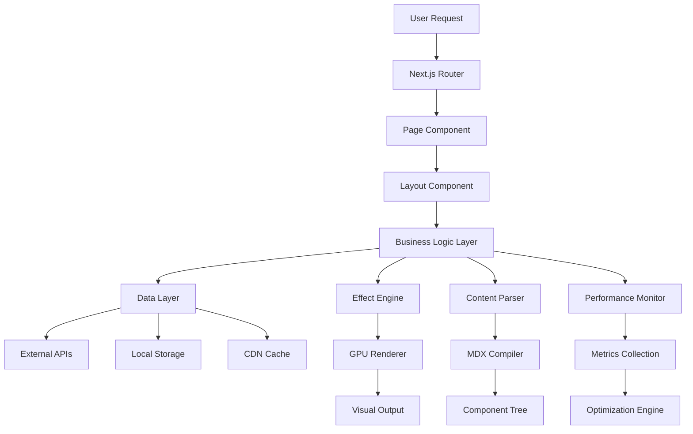

# System Architecture Design
## Liquid Glass Tech Blog Platform

### Executive Summary

This document defines the comprehensive system architecture for the Liquid Glass Tech Blog platform, a cutting-edge technical blog platform specializing in Liquid Glass and Glassmorphism design patterns. The architecture leverages Next.js 15 with App Router, TypeScript 5, Tailwind CSS 4, and advanced UI libraries to create a high-performance, visually stunning, and highly maintainable platform.

### Architecture Overview

```
┌─────────────────────────────────────────────────────────────────┐
│                        Presentation Layer                       │
├─────────────────────────────────────────────────────────────────┤
│  Next.js 15 App Router  │  React 19  │  TypeScript 5  │  PWA   │
│─────────────────────────┼────────────┼────────────────┼────────│
│    Liquid Glass UI      │ shadcn/ui  │   glasscn-ui   │ MDX 3  │
│─────────────────────────┼────────────┼────────────────┼────────│
│   Tailwind CSS 4       │ Framer     │   CSS-in-JS    │ Monaco │
│                         │ Motion     │                │ Editor │
├─────────────────────────────────────────────────────────────────┤
│                        Business Logic Layer                     │
├─────────────────────────────────────────────────────────────────┤
│  Content Management     │ Effect System │ Performance  │ Auth   │
│  ─────────────────      │ ────────────  │ ───────────  │ ────   │
│  • MDX Processing       │ • GPU Accel   │ • Core Vitals│ • JWT  │
│  • Search Engine        │ • Particle FX │ • Bundle Opt │ • RBAC │
│  • AI Image Gen         │ • Season Theme│ • Lazy Load  │ • 2FA  │
│  • CMS Integration      │ • Live Editor │ • CDN Cache  │ • OAuth│
├─────────────────────────────────────────────────────────────────┤
│                        Data Layer                               │
├─────────────────────────────────────────────────────────────────┤
│    Local Storage        │   External APIs   │    CDN Services   │
│    ──────────────       │   ─────────────   │    ─────────────  │
│  • Git-based CMS        │ • AI Image APIs   │  • Cloudinary     │
│  • Static Assets        │ • Weather API     │  • Vercel Edge    │
│  • Effect Library       │ • Analytics APIs  │  • CDN Cache      │
│  • User Preferences     │ • Search Index    │  • Asset Delivery │
└─────────────────────────────────────────────────────────────────┘
```

## Core Architecture Principles

### 1. Modular Component Design
- **Atomic Design Pattern**: Components organized in atoms, molecules, organisms
- **Composition over Inheritance**: Flexible component composition patterns
- **Separation of Concerns**: Clear boundaries between UI, logic, and data layers
- **Reusability**: Maximum component reuse across different contexts

### 2. Performance-First Architecture
- **Static Generation**: SSG with ISR for optimal loading performance
- **Progressive Enhancement**: Core functionality works without JavaScript
- **Critical Path Optimization**: Above-the-fold content prioritization
- **GPU Acceleration**: Hardware-accelerated Liquid Glass effects

### 3. Type Safety & Developer Experience
- **Strict TypeScript**: Comprehensive type coverage with strict mode
- **Design System**: Consistent type-safe design tokens
- **API Contracts**: Strongly typed API interfaces
- **Development Tools**: Enhanced debugging and development utilities

### 4. Scalability & Maintainability
- **Microservice Architecture**: Decoupled, independently deployable services
- **Clean Architecture**: Domain-driven design with clear dependencies
- **Event-Driven Updates**: Reactive state management patterns
- **Extensible Plugin System**: Easy feature addition and customization

## System Components

### Frontend Architecture

#### Component Hierarchy

```typescript
// Core Architecture Types
interface ArchitectureLayer {
  presentation: {
    pages: NextJSPage[];
    layouts: LayoutComponent[];
    components: UIComponent[];
  };
  business: {
    hooks: CustomHook[];
    services: BusinessService[];
    utilities: UtilityFunction[];
  };
  data: {
    providers: DataProvider[];
    repositories: Repository[];
    adapters: APIAdapter[];
  };
}

// Component Structure
interface ComponentArchitecture {
  // Atomic Components
  atoms: {
    Button: LiquidGlassButton;
    Input: GlassInput;
    Card: LiquidGlassCard;
    Icon: AnimatedIcon;
  };
  
  // Molecular Components
  molecules: {
    SearchBar: InteractiveSearch;
    ArticleCard: ContentCard;
    EffectPreview: LivePreview;
    Navigation: ResponsiveNav;
  };
  
  // Organism Components
  organisms: {
    Header: SiteHeader;
    Sidebar: ContentSidebar;
    ArticleList: PaginatedList;
    EffectEditor: CodeEditor;
  };
  
  // Template Components
  templates: {
    BlogLayout: ContentLayout;
    AdminLayout: DashboardLayout;
    ShowcaseLayout: GalleryLayout;
  };
}
```

#### State Management Architecture

```typescript
// Global State Structure
interface GlobalState {
  // UI State
  theme: {
    mode: 'light' | 'dark' | 'system';
    season: 'spring' | 'summer' | 'autumn' | 'winter';
    liquidGlass: LiquidGlassConfig;
    accessibility: AccessibilitySettings;
  };
  
  // Content State
  content: {
    articles: Article[];
    categories: Category[];
    tags: Tag[];
    searchResults: SearchResult[];
  };
  
  // User State
  user: {
    preferences: UserPreferences;
    session: UserSession;
    analytics: UserAnalytics;
  };
  
  // Performance State
  performance: {
    vitals: CoreWebVitals;
    resources: ResourceMetrics;
    effects: EffectPerformance;
  };
}
```

### Liquid Glass Effect System

#### Effect Architecture

```typescript
// Liquid Glass Core Types
interface LiquidGlassSystem {
  // Effect Engine
  engine: {
    renderer: WebGLRenderer | CSS3Renderer;
    compositor: EffectCompositor;
    optimizer: PerformanceOptimizer;
    fallback: FallbackRenderer;
  };
  
  // Effect Types
  effects: {
    blur: BackdropBlurEffect;
    glass: GlassmorphismEffect;
    particle: ParticleSystemEffect;
    seasonal: SeasonalThemeEffect;
  };
  
  // Configuration
  config: {
    quality: 'low' | 'medium' | 'high' | 'ultra';
    performance: PerformanceProfile;
    accessibility: A11ySettings;
    browser: BrowserCapabilities;
  };
}

// GPU Acceleration Strategy
interface GPUAcceleration {
  detection: {
    webgl: boolean;
    hardware: boolean;
    memory: number;
    performance: GPUTier;
  };
  
  optimization: {
    layerComposition: boolean;
    textureMemory: number;
    frameRate: number;
    fallbackMode: boolean;
  };
}
```

### Content Management System

#### MDX Processing Pipeline

```typescript
// Content Processing Architecture
interface ContentSystem {
  // MDX Pipeline
  mdx: {
    parser: MDXParser;
    transformer: ContentTransformer;
    compiler: MDXCompiler;
    optimizer: ContentOptimizer;
  };
  
  // Search System
  search: {
    indexer: ContentIndexer;
    engine: SearchEngine;
    analyzer: TextAnalyzer;
    ranker: RelevanceRanker;
  };
  
  // AI Integration
  ai: {
    imageGenerator: AIImageService;
    contentAnalyzer: ContentAnalyzer;
    seoOptimizer: SEOOptimizer;
    tagGenerator: AutoTagging;
  };
}
```

## Performance Architecture

### Core Web Vitals Strategy

```typescript
// Performance Monitoring System
interface PerformanceArchitecture {
  // Metrics Collection
  vitals: {
    lcp: LargestContentfulPaint; // Target: <2.5s
    inp: InteractionToNextPaint; // Target: <200ms
    cls: CumulativeLayoutShift; // Target: <0.1
    fcp: FirstContentfulPaint;   // Target: <1.8s
  };
  
  // Optimization Strategies
  optimization: {
    bundleSplitting: CodeSplittingStrategy;
    imageLazyLoading: LazyLoadingConfig;
    criticalCSS: CriticalPathCSS;
    preloadStrategy: ResourcePreloading;
  };
  
  // Monitoring
  monitoring: {
    realUserMetrics: RUMCollection;
    syntheticMonitoring: SyntheticTests;
    performanceBudgets: BudgetEnforcement;
    alerting: PerformanceAlerts;
  };
}
```

### Bundle Optimization Strategy

```typescript
// Code Splitting Configuration
interface BundleStrategy {
  // Entry Points
  entries: {
    main: 'app/layout.tsx';
    blog: 'app/(blog)/layout.tsx';
    admin: 'app/(admin)/layout.tsx';
    showcase: 'app/(showcase)/layout.tsx';
  };
  
  // Chunks
  chunks: {
    vendor: ['react', 'next'];
    ui: ['@shadcn/ui', '@glasscn/ui'];
    effects: ['@liquid-glass', 'framer-motion'];
    editor: ['monaco-editor', 'codemirror'];
  };
  
  // Loading Strategy
  loading: {
    critical: 'sync';     // Core UI components
    secondary: 'async';   // Non-critical features
    onDemand: 'lazy';     // Admin/editor features
    prefetch: 'idle';     // Likely next navigation
  };
}
```

## Security Architecture

### Security Layers

```typescript
// Security Implementation
interface SecurityArchitecture {
  // Authentication & Authorization
  auth: {
    provider: 'NextAuth.js';
    strategies: ['JWT', 'OAuth', 'Magic Link'];
    rbac: RoleBasedAccessControl;
    mfa: MultiFactorAuth;
  };
  
  // Content Security
  content: {
    sanitization: HTMLSanitizer;
    xssProtection: XSSPrevention;
    csrfProtection: CSRFTokens;
    inputValidation: InputValidator;
  };
  
  // Infrastructure Security
  infrastructure: {
    headers: SecurityHeaders;
    csp: ContentSecurityPolicy;
    https: HTTPSEnforcement;
    rateLimit: RateLimiter;
  };
}
```

## Accessibility Architecture

### Universal Design Implementation

```typescript
// Accessibility System
interface AccessibilityArchitecture {
  // WCAG 2.1 AA Compliance
  wcag: {
    perceivable: PerceivableGuidelines;
    operable: OperableGuidelines;
    understandable: UnderstandableGuidelines;
    robust: RobustGuidelines;
  };
  
  // Adaptive Interfaces
  adaptive: {
    reducedMotion: MotionPreferences;
    highContrast: ColorSchemes;
    fontSize: ScalingOptions;
    keyboardNav: KeyboardInterface;
  };
  
  // Assistive Technology
  assistive: {
    screenReader: ARIAImplementation;
    voiceControl: VoiceInterface;
    eyeTracking: GazeInterface;
    switch: SwitchInterface;
  };
}
```

## Deployment Architecture

### Multi-Environment Strategy

```typescript
// Deployment Configuration
interface DeploymentArchitecture {
  // Environment Stages
  environments: {
    development: LocalDevelopment;
    staging: StagingEnvironment;
    production: ProductionEnvironment;
    edge: EdgeDeployment;
  };
  
  // CI/CD Pipeline
  pipeline: {
    build: BuildProcess;
    test: TestSuite;
    security: SecurityScan;
    deploy: DeploymentProcess;
  };
  
  // Monitoring & Observability
  observability: {
    logging: StructuredLogging;
    metrics: PerformanceMetrics;
    tracing: DistributedTracing;
    alerting: AlertingSystem;
  };
}
```

## Data Flow Architecture

### Information Architecture



## Technology Integration Map

### Library Integration Strategy

```typescript
// Integration Architecture
interface IntegrationMap {
  // Core Framework
  nextjs: {
    version: '15.x';
    features: ['App Router', 'Server Components', 'Turbopack'];
    optimization: ['Static Generation', 'Image Optimization'];
  };
  
  // UI Libraries
  ui: {
    shadcn: ComponentLibrary;
    glasscn: LiquidGlassExtensions;
    tailwind: UtilityClasses;
    framer: AnimationEngine;
  };
  
  // Content Management
  content: {
    mdx: ContentProcessor;
    search: SearchEngine;
    ai: AIServices;
    analytics: DataCollection;
  };
  
  // Performance
  performance: {
    bundler: CodeSplitting;
    cdn: AssetDelivery;
    monitoring: RealTimeMetrics;
    optimization: AutoOptimization;
  };
}
```

This architecture provides a solid foundation for building a high-performance, scalable, and maintainable Liquid Glass Tech Blog platform that leverages modern web technologies while delivering an exceptional user experience.