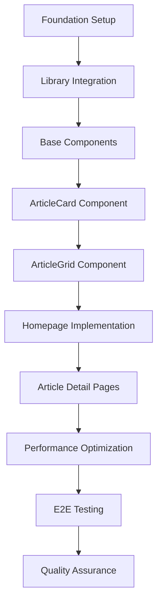

# Phase 6.2 Dependency Mapping & Implementation Timeline

## Critical Path Analysis

### Primary Dependencies



## Dependency Matrix

### Phase 6.2.1: Foundation Setup
| Component | Depends On | Blocks | Priority | Duration |
|-----------|------------|--------|----------|----------|
| App Router Structure | None | All Page Components | Critical | 30min |
| Library Installation | None | All Components | Critical | 15min |
| TypeScript Config | App Router | Type Safety | Critical | 15min |
| Tailwind Configuration | Library Installation | Styling | Critical | 30min |
| Testing Setup | TypeScript Config | All Tests | Critical | 45min |

### Phase 6.2.2: Core Components
| Component | Depends On | Blocks | Priority | Duration |
|-----------|------------|--------|----------|----------|
| Enhanced shadcn/ui Components | Foundation Setup | All UI Components | Critical | 60min |
| useReducedMotion Hook | Testing Setup | Accessibility Features | High | 30min |
| LiquidGlassWrapper | Library Integration + Hook | All Glass Effects | Critical | 45min |
| ArticleCard (Tests) | Testing Setup | ArticleCard Implementation | Critical | 45min |
| ArticleCard (Implementation) | Enhanced Components + Wrapper | ArticleGrid | Critical | 90min |
| ArticleGrid (Tests) | ArticleCard Tests | ArticleGrid Implementation | High | 30min |
| ArticleGrid (Implementation) | ArticleCard + Suspense | Page Components | Critical | 60min |

### Phase 6.2.3: Page Implementation
| Component | Depends On | Blocks | Priority | Duration |
|-----------|------------|--------|----------|----------|
| Article Data Layer | TypeScript Config | All Pages | Critical | 45min |
| Homepage (Tests) | ArticleGrid + Data Layer | Homepage Implementation | Critical | 30min |
| Homepage (Implementation) | ArticleGrid + Data Layer | Homepage Features | Critical | 60min |
| Article Detail (Tests) | Data Layer | Article Detail Implementation | Critical | 45min |
| Article Detail (Implementation) | Data Layer + SEO Utils | Article Features | Critical | 90min |
| SEO Structured Data | Article Data Layer | SEO Optimization | High | 30min |
| Dynamic Routing | Next.js 15 Setup | Navigation | High | 30min |

### Phase 6.2.4: Performance Optimization
| Component | Depends On | Blocks | Priority | Duration |
|-----------|------------|--------|----------|----------|
| Image Optimization | Next.js Image + Cloudinary | Image Performance | High | 45min |
| Bundle Analysis | All Components | Bundle Optimization | Medium | 30min |
| Dynamic Imports | Components | Loading Performance | High | 30min |
| Web Vitals Monitoring | All Pages | Performance Tracking | High | 30min |
| GPU Acceleration | Liquid Glass Components | Animation Performance | Medium | 45min |

### Phase 6.2.5: Testing & QA
| Component | Depends On | Blocks | Priority | Duration |
|-----------|------------|--------|----------|----------|
| E2E Test Setup | All Pages | E2E Testing | High | 30min |
| Performance Tests | All Components | Performance Validation | High | 45min |
| Accessibility Tests | All Components | A11y Compliance | Critical | 60min |
| Visual Regression Tests | All Components | UI Consistency | Medium | 45min |
| Coverage Reporting | All Tests | Quality Gates | High | 15min |

## Critical Path Schedule

### Day 1: Foundation & Core Components (8 hours)

#### Morning Session (4 hours)
```bash
09:00-09:30  Phase 6.2.1: Foundation Setup
  ├── App Router structure creation (15min)
  ├── Library installation & configuration (30min)
  └── Testing environment setup (45min)

09:30-11:30  Enhanced shadcn/ui Components
  ├── Card component enhancement with liquid glass (45min)
  ├── Badge and Button enhancements (30min)
  ├── Skeleton components for loading states (30min)
  └── Component testing setup (15min)

11:30-13:00  LiquidGlassWrapper & Hooks
  ├── useReducedMotion hook implementation (30min)
  ├── LiquidGlassWrapper component (45min)
  └── Integration testing (15min)
```

#### Afternoon Session (4 hours)
```bash
14:00-16:30  ArticleCard Development (TDD)
  ├── ArticleCard test implementation (45min)
  ├── ArticleCard component implementation (90min)
  └── Integration with liquid glass effects (15min)

16:30-18:00  ArticleGrid Development
  ├── ArticleGrid tests (30min)
  ├── ArticleGrid implementation with Suspense (45min)
  └── Responsive layout testing (15min)
```

### Day 2: Page Implementation (8 hours)

#### Morning Session (4 hours)
```bash
09:00-10:00  Data Layer Implementation
  ├── Article types and interfaces (20min)
  ├── Data fetching functions (30min)
  └── Caching strategy implementation (10min)

10:00-12:00  Homepage Implementation (TDD)
  ├── Homepage tests (30min)
  ├── Homepage component with ISR (60min)
  └── SEO metadata implementation (30min)

12:00-13:00  Homepage Optimization
  ├── Loading states and Suspense (30min)
  └── Performance optimization (30min)
```

#### Afternoon Session (4 hours)
```bash
14:00-16:30  Article Detail Pages (TDD)
  ├── Article detail page tests (45min)
  ├── Article detail implementation (90min)
  └── Dynamic routing with Promise params (15min)

16:30-18:00  SEO & Structured Data
  ├── JSON-LD structured data (45min)
  ├── Dynamic sitemap generation (30min)
  └── Open Graph optimization (15min)
```

### Day 3: Performance & Testing (8 hours)

#### Morning Session (4 hours)
```bash
09:00-11:00  Performance Optimization
  ├── Image optimization implementation (45min)
  ├── Bundle analysis and code splitting (30min)
  ├── Web Vitals monitoring setup (30min)
  └── GPU acceleration testing (15min)

11:00-13:00  Unit Test Completion
  ├── Component test coverage verification (60min)
  └── Performance test implementation (60min)
```

#### Afternoon Session (4 hours)
```bash
14:00-16:30  E2E Testing Implementation
  ├── Playwright test setup (30min)
  ├── User journey testing (60min)
  ├── Performance testing with Lighthouse (45min)
  └── Accessibility testing (15min)

16:30-18:00  Quality Assurance
  ├── Test coverage analysis (30min)
  ├── Performance benchmark validation (30min)
  ├── Accessibility compliance check (30min)
  └── Final integration testing (30min)
```

## Risk Dependencies

### High-Risk Dependencies
1. **@specy/liquid-glass-react Compatibility**
   - **Risk**: Library compatibility issues with React 19
   - **Mitigation**: Thorough testing, fallback to CSS-only effects
   - **Blocking**: All liquid glass components

2. **Next.js 15 Promise-based Params**
   - **Risk**: Breaking changes in param handling
   - **Mitigation**: Extensive testing, backward compatibility layer
   - **Blocking**: All dynamic routes

3. **Performance Targets**
   - **Risk**: Liquid glass effects impacting Core Web Vitals
   - **Mitigation**: GPU acceleration, progressive enhancement
   - **Blocking**: Quality gates

### Medium-Risk Dependencies
1. **shadcn/ui + glasscn-ui Integration**
   - **Risk**: Style conflicts between libraries
   - **Mitigation**: CSS specificity testing, custom theme variables
   - **Blocking**: UI consistency

2. **Test Coverage Targets**
   - **Risk**: Complex liquid glass components difficult to test
   - **Mitigation**: Mock strategies, visual regression testing
   - **Blocking**: Quality gates

## Parallel Development Opportunities

### Can Be Developed in Parallel
```bash
# After Foundation Setup (Phase 6.2.1)
├── Enhanced shadcn/ui Components (Independent)
├── useReducedMotion Hook (Independent)
├── Article Data Layer (Independent)
└── SEO Utilities (Independent)

# After Core Components (Phase 6.2.2)
├── Homepage Tests (Uses ArticleGrid)
├── Article Detail Tests (Uses ArticleCard)
├── Performance Monitoring (Independent)
└── E2E Test Setup (Independent)
```

### Must Be Sequential
```bash
# Critical Path - Cannot Parallelize
Foundation Setup → Library Integration → 
LiquidGlassWrapper → ArticleCard → 
ArticleGrid → Page Components → 
Performance Optimization → Quality Gates
```

## Resource Allocation

### Development Team Structure
```bash
Primary Developer (Full-time)
├── Foundation setup and architecture
├── Core component development (ArticleCard, ArticleGrid)
├── Page implementation (Homepage, Article Detail)
└── Performance optimization

Test Engineer (Part-time)
├── E2E test implementation
├── Performance testing
├── Accessibility validation
└── Quality assurance

QA Reviewer (Part-time)
├── Code review and quality gates
├── Performance benchmark validation
├── User acceptance testing
└── Final integration validation
```

### Critical Skills Required
1. **Next.js 15 App Router**: Advanced knowledge of new features
2. **React 19**: Understanding of new concurrent features
3. **TypeScript 5.x**: Strict typing and advanced patterns
4. **Performance Optimization**: Core Web Vitals expertise
5. **Accessibility**: WCAG 2.1 AA compliance knowledge
6. **Testing**: TDD, E2E, and performance testing

## Success Metrics & Gates

### Quality Gates by Phase
```bash
Phase 6.2.1 Gate: Foundation ✓
├── TypeScript builds without errors
├── Tests run successfully
├── Libraries integrate properly
└── Basic routing works

Phase 6.2.2 Gate: Components ✓
├── ArticleCard renders correctly
├── Liquid glass effects work
├── Accessibility attributes present
└── Test coverage >90%

Phase 6.2.3 Gate: Pages ✓
├── Homepage loads with articles
├── Article detail pages work
├── SEO metadata generated
└── Performance within targets

Phase 6.2.4 Gate: Performance ✓
├── LCP <2.5s achieved
├── INP <200ms achieved
├── CLS <0.1 achieved
└── Bundle size optimized

Phase 6.2.5 Gate: Quality ✓
├── E2E tests pass
├── Accessibility compliant
├── Performance validated
└── 95% test coverage achieved
```

This dependency mapping ensures efficient development flow while maintaining quality standards and meeting all performance targets.